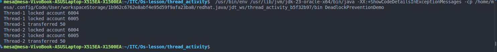

# Institute of Technology of Cambodia
## Department of Information and communication Engineering
### Name: HONG Dyhengmesa
### ID  : e20220997


## 1. Introduction

```
In operating systems, a deadlock occurs when two or more processes or threads are blocked forever, each waiting for a resource held by another. Deadlocks commonly appear in concurrent systems where shared resources such as memory, files, or bank accounts are accessed simultaneously.

This report explains:

What deadlock is

How deadlock can occur using a bank account transfer example

How deadlock can be prevented using fixed resource ordering
``` 
## 2. Objective
```
The objectives of this activity are:

To simulate a deadlock using concurrent threads

To understand the cause of deadlock

To implement a deadlock prevention technique

To analyze how fixed ordering avoids circular wait
```
## 3. Deadlock Concept
```
A deadlock occurs when the following four conditions hold simultaneously:

Mutual Exclusion – Resources cannot be shared

Hold and Wait – A process holds one resource and waits for another

No Preemption – Resources cannot be forcibly taken

Circular Wait – A circular chain of processes exists

If any one of these conditions is prevented, deadlock will not occur.
```
## 4. Deadlock Simulation (Bank Account Transfer)
````
4.1 Scenario

Two bank accounts are shared resources:

Account 6004

Account 6005

Two threads attempt to transfer money between these accounts at the same time.

4.2 Deadlock Situation

Thread 1 locks Account 6004 and waits for Account 6005

Thread 2 locks Account 6005 and waits for Account 6004

Both threads wait forever

This creates a circular wait, causing deadlock.
````
## 5. Deadlock Prevention Technique
```
5.1 Fixed Resource Ordering

Deadlock is prevented by enforcing a global order when locking resources.

Steps:

Always lock the account with the smaller ID first

Lock the account with the larger ID second

Perform the transfer

Release the locks in reverse order

This technique removes the circular wait condition.
```

## 6. Implementation Explanation
```
The transfer function first determines the order of locking using the account IDs:

min(account1, account2) is locked first

max(account1, account2) is locked second

Because all threads follow the same order, deadlock cannot occur even if transfers happen in opposite directions.
```
## 7. Result



## 8. Conclusion
```
Deadlock is a serious issue in concurrent systems but can be prevented through careful design. In this activity, deadlock was avoided by using fixed resource ordering. This method is simple, effective, and commonly used in real-world systems such as databases and operating systems.
```